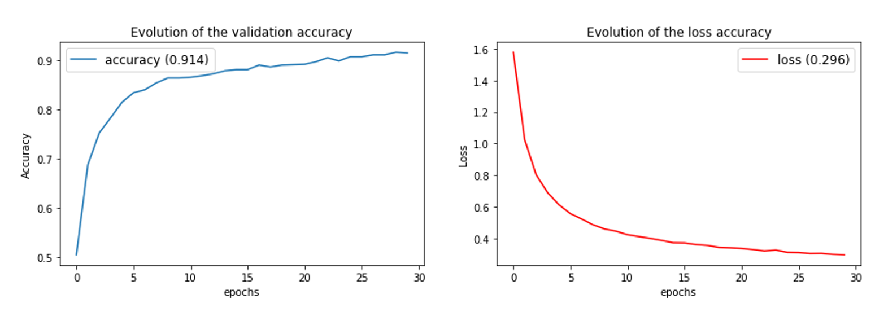

# Aerial_Challenge

[Aerial](https://codalab.lisn.upsaclay.fr/competitions/573) is a machine learning challenge on CodaLab Platform. It's a multi-class geographic image classification.

I worked in a team of 3 to solve the challenge using Deep Learning with Tensorflow. We were able to acheive 91.4% accuracy using a pre-trained model (ResNet50) and data-augmentation .

 

# Results

